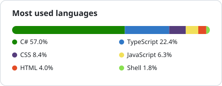

Software Engineer with 10+ years shipping customer-facing tools and partner
integrations. I like taking unclear problems, shaping the technical plan, and staying
close enough to the code to help ship it. I invest in the parts that outlast a feature:
systems design, code review, mentoring, and practical AI across the SDLC.

## Currently
- Building **[Reminders](https://github.com/kauereinbold/Reminders)**, a web app for managing daily reminders.
- Contributing to **[Orcasound](https://github.com/orcasound)**, open-source orca-detection tooling.

## Writing
<!-- BLOG:START -->
- [Smooth Sailing: Debugging Your .NET Application on Containers with VS Code and Docker](https://medium.com/@kauereinbold/smooth-sailing-debugging-your-net-application-on-containers-with-vs-code-and-docker-bfae6ffba110)
- [[NestJS] Acessing a database](https://medium.com/@kauereinbold/nestjs-acessing-a-database-f8f647bec198)
- [[Docker] Use profiles on docker-compose](https://medium.com/@kauereinbold/docker-use-profiles-in-docker-compose-f5739e1288dc)
<!-- BLOG:END -->

## Recent open-source
<!-- OSS:START -->
- [`orcasound/orcahello`](https://github.com/orcasound/orcahello/pull/569): Fix invisible spectrogram region shades and silent audio load failures (2026-08-01)
- [`orcasound/orcahello`](https://github.com/orcasound/orcahello/pull/559): Fix Details links opened in a new tab showing the candidates page (2026-07-31)
<!-- OSS:END -->

## Elsewhere
[Medium](https://medium.com/@kauereinbold) · [LinkedIn](https://www.linkedin.com/in/kaue-reinbold) · Curitiba, Brazil

## Stack

**Languages:** C# · TypeScript · JavaScript · Python · SQL

**Frameworks & runtimes:** .NET · React · Node.js

**Platform & tooling:** Azure · Docker · GitHub Actions

<!-- LANGS:START -->
<picture>
  <source media="(prefers-color-scheme: dark)" srcset="assets/langs-dark.svg">
  
</picture>
<!-- LANGS:END -->
